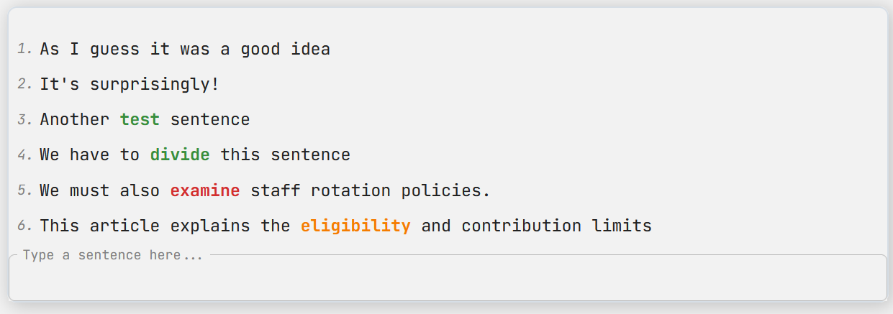

<!-- PROJECT LOGO -->
 

  

<h3 align="center">Language Learning</h3>
  

    An interactive language learning platform that combines video lessons, adaptive learning, and personalized dictionaries. Users can save, review, and translate words, create their own lists for review, and track their progress in real time.
     
     
    <a href="https://language-learning-seven-virid.vercel.app">View Demo</a>
    &middot;
    <a href="https://github.com/woxer77/language-learning/issues/new?labels=bug&template=bug-report---.md">Report Bug</a>
    &middot;
    <a href="https://github.com/woxer77/language-learning/issues/new?labels=enhancement&template=feature-request---.md">Request Feature</a>
  

<!-- TABLE OF CONTENTS -->

  
Table of Contents

  <ol>
    <li><a href="#problematics">Problematics</a></li>
    <li><a href="#about-the-project">About The Project</a></li>
    <li><a href="#usage">Usage</a></li>
    <li><a href="#roadmap">Roadmap</a></li>
    <li><a href="#contact">Contact</a></li>
  </ol>

<!-- PROBLEMATICS -->
## Problematics

When I began learning English, I discovered an incredibly helpful video playlist. To practice translating and composing sentences, I initially used a standard Word document. This method quickly proved to be inconvenient and inefficient, lacking both structure and accessibility.

Driven by the desire for a better learning experience, I decided to create my own website. Now, language study is not only productive, but also enjoyable. All my progress is securely stored in a database, allowing me to seamlessly continue learning from any device, without being tied to a specific computer or document. This platform has transformed my language journey, making practice easy, engaging, and always accessible.

### TL;DR

I found a useful playlist for practicing English, but using Word was inconvenient. So I created this website — now my progress is saved online and learning is much easier and more enjoyable.

<!-- ABOUT THE PROJECT -->
## About The Project

![Product Name Screen Shot][product-screenshot]

Language Learning is a modern web platform designed to make learning English convenient, interactive, and effective for users of all skill levels. The platform combines video lessons, personalized dictionaries, and automated translation to support a flexible and secure learning experience.

**Key Features:**
- An interactive main page with access to video lessons, dictionaries, a field for entering translated sentences, and easy navigation between lessons.
- Personalized dictionary with knowledge levels (weak, medium, strong), color-coded for quick recognition, drag & drop organization, and instant translation for each word or phrase.
- Highlighting words from the dictionary in the sentence history, color-coded by knowledge level, to help users focus on words that need more attention and avoid duplicates.
- Secure registration and authentication using JWT to protect user data.
- A landing page for entering video or playlist links, with history and favorites synced to the user account for quick access from any device.
- Intuitive interface design focused on user experience, with quick access to all main features and clear visual cues for knowledge levels.
- Integration with YouTube API for seamless viewing of educational videos directly on the platform.
- Integration with DeepL Translate API for automated translation of new words and phrases.

### Built With

* [![React][React.js]][React-url]
* [![TypeScript][TypeScript.js]][TypeScript-url]
* [![React Query][ReactQuery.js]][ReactQuery-url]
* [![Redux][Redux.js]][Redux-url]
* [![Node][Node.js]][Node-url]
* [![Express][Express.js]][Express-url]
* [![JWT][JWT.js]][JWT-url]
* [![SCSS][SCSS.js]][SCSS-url]

(<a href="#readme-top">back to top</a>)

<!-- USAGE EXAMPLES -->
## Usage

### 1. Open the Website
<a href="https://language-learning-seven-virid.vercel.app">Visit the platform</a> in your browser.

### 2. Login or Register
Have an account -> enter email and password -> click "Sign In" button.
 
Don't have an account -> click "Sign Up" button-link -> complete the form -> click "Sign Up" button.
  
`For Demonstration purposes:`
<table>
  <tr>
    <th>Email</th>
    <th>Password</th>
  </tr>
  <tr>
    <td>test@gmail.com</td>
    <td>Qwerty123</td>
  </tr>
</table>

### 3. Enter a YouTube Link
Paste a valid YouTube URL to a playlist or a single video and submit.  
*for a better experience recommended to paste URL to a playlist*
  

  
`For Demonstration purposes:` 
Click the "History" button below the input field and select a pre-prepared playlist in the modal.

### 4. Watch Video
On the main page, the YouTube player will show your selected video or the first video from your playlist. 
Use the player controls to play, pause, or adjust volume.

### 5. Enter Sentences
Below the video, type translated sentences or words into English in the input field. 
Press Enter to save your sentence. It will appear in the sentence history above.  
While typing in the input field, you can conveniently rewind the video by 3 seconds using `CTRL + ARROW (left/right)` hotkeys. This makes it easy to review or repeat parts of the video without leaving the input field.
  

### 6. Highlight and Add Words to Dictionary
In the sentence history, words already in your dictionary are color-coded by knowledge level. 
Select a word or phrase to open a popup and add it to your dictionary. Choose the type (word/expression) and level (weak, medium, strong).
  

### 7. View and Organize Dictionary
If your dictionary has more than 10 items, use pagination to browse. 
Use the filter buttons to view words by knowledge level. 
Drag and drop words between levels to update your progress.
  

(<a href="#readme-top">back to top</a>)

<!-- ROADMAP -->
## Roadmap

- [x] Rewind video with `CTRL + ARROW <right || left>` hotkey when focused on the input field
- [x] Last visited playlist history
- [x] Remember last visited video in playlist
- [ ] Change translate language support
- [ ] Guide to using the site for new users

(<a href="#readme-top">back to top</a>)

<!-- CONTACT -->
## Contact

Denis Ohrimenko - woxer77@gmail.com

Project Link: [https://github.com/woxer77/language-learning](https://github.com/woxer77/language-learning)

(<a href="#readme-top">back to top</a>)

<!-- MARKDOWN LINKS & IMAGES -->
<!-- https://www.markdownguide.org/basic-syntax/#reference-style-links -->
[product-screenshot]: front/public/interface.png
[React.js]: https://img.shields.io/badge/React-20232A?style=for-the-badge&logo=react&logoColor=61DAFB
[React-url]: https://reactjs.org/
[Redux.js]: https://img.shields.io/badge/Redux-593D88?style=for-the-badge&logo=redux&logoColor=white
[Redux-url]: https://redux.js.org/
[Node.js]: https://img.shields.io/badge/Node.js-339933?style=for-the-badge&logo=nodedotjs&logoColor=white
[Node-url]: https://nodejs.org/
[TypeScript.js]: https://img.shields.io/badge/TypeScript-007ACC?style=for-the-badge&logo=typescript&logoColor=white
[TypeScript-url]: https://www.typescriptlang.org/
[SCSS.js]: https://img.shields.io/badge/SCSS-CC6699?style=for-the-badge&logo=sass&logoColor=white
[SCSS-url]: https://sass-lang.com/
[Express.js]: https://img.shields.io/badge/Express.js-000000?style=for-the-badge&logo=express&logoColor=white
[Express-url]: https://expressjs.com/
[ReactQuery.js]: https://img.shields.io/badge/React_Query-FF4154?style=for-the-badge&logo=react-query&logoColor=white
[ReactQuery-url]: https://tanstack.com/query/latest
[JWT.js]: https://img.shields.io/badge/JWT-000000?style=for-the-badge&logo=jsonwebtokens&logoColor=white
[JWT-url]: https://jwt.io/
